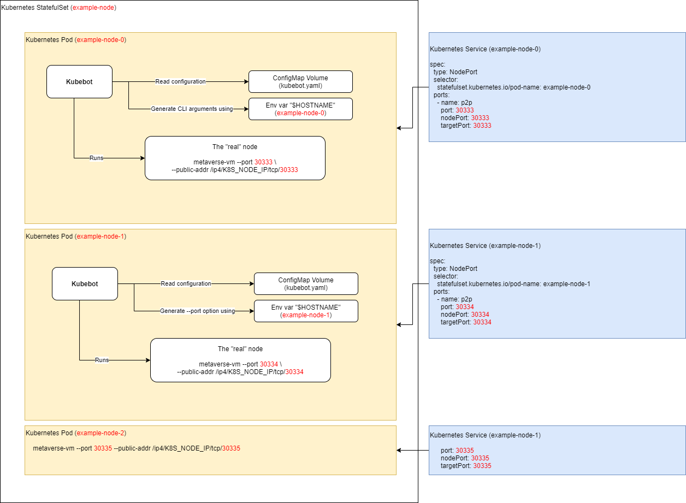

<!-- TOC -->

- [1. architecture](#1-architecture)
- [2. require](#2-require)
- [3. image build(if you need)](#3-image-buildif-you-need)
  - [3.1. snapshot-init-container](#31-snapshot-init-container)
  - [3.2. node-liveness-probe](#32-node-liveness-probe)
  - [3.3. kubebot](#33-kubebot)
  - [3.4. hyperspace](#34-hyperspace)
- [4. Some things to know](#4-some-things-to-know)
  - [4.1. Concepts](#41-concepts)
  - [4.2. startup](#42-startup)
  - [4.3. storage](#43-storage)
  - [4.4. network](#44-network)
- [5. Run](#5-run)
  - [5.1. Prepare storage resources](#51-prepare-storage-resources)
    - [5.1.1. Notice](#511-notice)
    - [5.1.2. Nfs server installation](#512-nfs-server-installation)
  - [5.2. Start Deploy](#52-start-deploy)
- [6. Check](#6-check)
- [7. Clean](#7-clean)

<!-- /TOC -->
# 1. architecture




# 2. require

The following components need to be installed before deployment

1. [Docker-cli](https://docs.docker.com/docker-for-mac/install/)
2. [Kubectl](https://kubernetes.io/docs/tasks/tools/)
3. [Kustomize](https://kubernetes.io/docs/tasks/manage-kubernetes-objects/kustomization/)
3. [Kubernetes Cluster](https://kubernetes.io/docs/setup/production-environment/tools/)

# 3. image build(if you need)

If you just want to learn how to deploy and don’t care about compilation, please skip this step and just use the compiled package on docker.

## 3.1. snapshot-init-container

This image is just to pull out the database, unzip it, and place it in a directory to prepare for the real validate node(`hyperspace`) use later.Of course, if you are just for verification, you can also manually execute entrypoint.sh as defined by the dockerfile.Two of the following environment variable parameters must be set.

1. `ARCHIVE_URL` : an archive version of the DB of hyperspance or any other network(example: `https://wallet.oracol.org/hyperspace.tar.gz`)
2. `CHAIN_DIR` : the path of chain directory(exammple: `/data`)

```shell
git clone https://github.com/mvs-org/snapshot-init-container
cd snapshot-init-container
docker build -t viewfintest/snapshot-init-container .
```

## 3.2. node-liveness-probe

This image is a probe for a valitor node, which mainly exposes some http interfaces for health checks. Because the kubernates check does not directly support ws, a container is needed to convert ws to http.

```shell
git clone https://github.com/mvs-org/node-liveness-probe
cd node-liveness-probe
docker build -t viewfintest/node-liveness-probe .
```

## 3.3. kubebot

The purpose of this image as an initialization container is only to put the compiled binary on the verification node(viewfintest/hyperspace). The compiled binary file actually runs on the verification node.

```shell
git clone https://github.com/mvs-org/kubebot
cd kubebot
docker build -t viewfintest/kubebot .
```

## 3.4. hyperspace

This is a real node that actually needs to run, and then the mirror only provides the environment needed for running. The actual running process is the binary file kuebot shared by `viewfintest/kubebot`. Kubebot can be considered as a wrapper for the operation of a hyperspace. Kubebot generates and runs hyperspace startup commands according to the configuration file, and processes logs. The following startup parameters are required.

1. `config` : path to the config file
2. `watch-config` : watch config file changes and restart node with new config.About the details of the configuration file, you can refer to this file [kubebot.yaml](./docs/kubebot.yaml)
3. `dry-run` : print the final rendered command line and exit(just to verify the configuration without any actual impact)

```shell
git clone https://github.com/inodelisia/metaverse-vm
cd metaverse-vm
docker build -t viewfintest/hyperspace .
```

# 4. Some things to know

## 4.1. Concepts

Before running, you need to understand the following related concepts:

1. Kustomize: is a standalone tool to customize Kubernetes objects through a kustomization file. For more information, you can learn more from this link [https://kubernetes.io/docs/tasks/manage-kubernetes-objects/kustomization/](https://kubernetes.io/docs/tasks/manage-kubernetes-objects/kustomization/)
2. kubernetes(If you don’t know how to use or how to configure, you can execute the `kubectl explain` command to query related information, such as `kubectl explain StatefulSet` )
   1. StatefulSet: [https://kubernetes.io/docs/concepts/workloads/controllers/statefulset/](https://kubernetes.io/docs/concepts/workloads/controllers/statefulset/)
   2. ServiceAccount: [https://kubernetes.io/docs/tasks/configure-pod-container/configure-service-account/](https://kubernetes.io/docs/tasks/configure-pod-container/configure-service-account/)
   3. Headless Services & Services: [https://kubernetes.io/docs/concepts/services-networking/service/](https://kubernetes.io/docs/concepts/services-networking/service/)
   4. StorageClass: [https://kubernetes.io/docs/concepts/storage/storage-classes/](https://kubernetes.io/docs/concepts/storage/storage-classes/)
   5. PersistentVolume & PersistentVolumeClaim: [https://kubernetes.io/docs/concepts/storage/persistent-volumes/](https://kubernetes.io/docs/concepts/storage/persistent-volumes/)
   6. Volumes: [https://kubernetes.io/docs/concepts/storage/volumes/](https://kubernetes.io/docs/concepts/storage/volumes/)
   7. Configure-liveness-readiness-startup-probes:[https://kubernetes.io/docs/tasks/configure-pod-container/configure-liveness-readiness-startup-probes/](https://kubernetes.io/docs/tasks/configure-pod-container/configure-liveness-readiness-startup-probes/)
   8. Manage-resources-containers: [https://kubernetes.io/docs/concepts/configuration/manage-resources-containers/](https://kubernetes.io/docs/concepts/configuration/manage-resources-containers/)
   9. RBAC: [https://kubernetes.io/docs/reference/access-authn-authz/rbac/](https://kubernetes.io/docs/reference/access-authn-authz/rbac/)
   10. ConfigMaps: [https://kubernetes.io/docs/concepts/configuration/configmap/](https://kubernetes.io/docs/concepts/configuration/configmap/)


## 4.2. startup

We take the example folder as an example, where statefulset.yaml is the most important. It contains the following containers.They start in the order defined in the yaml file, where snapshot-init-container and kubebot are the initialization containers, and their job is to prepare the database and binary files of kubebot to run.The hyperspace container is the real node to be run, and the node-liveness-probe container is responsible for the health check of the hyperspace container.

1. viewfintest/snapshot-init-container
2. viewfintest/kubebot
3. viewfintest/hyperspace
4. viewfintest/node-liveness-probe

## 4.3. storage

VolumeClaimTemplates is defined in StatefulSet, volumeClaimTemplates will find the PV(PersistentVolume) resource that defines this storageClass according to the defined storageClassName field, and then automatically create pvc(PersistentVolumeClaim), and then associate it to volume of pod.

## 4.4. network

ClusterIp is defined in the service. Verify that the node is accessed through clusterIp

# 5. Run

## 5.1. Prepare storage resources

Before you run, you need to install nfs as the storage resource behind

### 5.1.1. Notice

Need to replace `{NFS_HOST_IP}` `{NFS_HOST_PATH}` in the [nfs-client-provisioner.yaml](deploy/manifests/nfs-client-provisioner.yaml) file with the actual address

### 5.1.2. Nfs server installation

About nfs server installation. You can refer to this link [https://vitux.com/install-nfs-server-and-client-on-ubuntu/](https://vitux.com/install-nfs-server-and-client-on-ubuntu/).It should be noted that the nfs client needs to be installed on each kubernates node.

1. ubuntu
   ```shell
   sudo apt-get install nfs-common
   ```
2. centos
   ```shell
   sudo yum install nfs-utils
   ```
## 5.2. Start Deploy

You can refer to the README.md file in the example folder and run the following command:

```shell
cd example
# Compare the difference between the resource file and the actual running resource
kustomize build . | kubectl diff -f -
# Deploy resources into kubernates
kustomize build . | kubectl apply -f -
```

# 6. Check

You can execute the following command to check the created resources.If you want to query the specific reason for the failure, you can use the `kubectl describe $resource -n $namspace` command. And if you want to query the log of a certain container, you can use the `kubectl logs -f   $podName -c $containerName` command

```shell
# check StatefulSet
kubectl get sts  -n $namespace

# check Pod
kubectl get pod  -n $namespace

# check StorageClass
kubectl get StorageClass  -n $namespace

# check pv
kubectl get pv  -n $namespace

# check pvc
kubectl get pvc -n $namespace

# check ServiceAccount
kubectl get ServiceAccount -n $namespace

# check ClusterRole
kubectl get ClusterRole -n $namespace

# check ClusterRoleBinding
kubectl get ClusterRoleBinding -n $namespace

# check service
kubectl get service
```

# 7. Clean

You can execute the following command to clean up resources

```shell
cd example
kustomize build . | kubectl delete  -f -
# because pvc is automatically generated, it needs to be cleaned up separately
kubectl delete pvc data-kubebot-hyperspace-0
```
